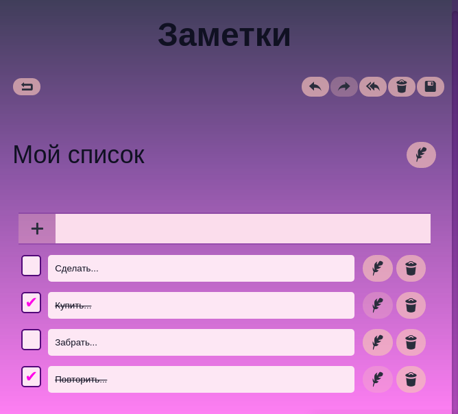

# To-do list "Notice"

## [DEMO](https://noticer.netlify.app/)

### Description

App has two pages. All actions carried out without reloading the page.
Confirm actions is performed using a dialog modal window.
After reloading the page, the state of the list of notes is saved using local storage.

List of all notes is displayed on the main page.
For each note, are displayed a title and reduced todo list, without the ability to change.
In the absence of items in the list displays information about this.

Actions on the main page:
+ go on to create a new note
+ go to edit a note
+ delete (confirmation required)

Actions with a note:
+ save changes
+ cancel changes (confirmation required)
+ delete (confirmation required)
+ undo change
+ redo change

Actions with a todo items:
+ add
+ remove
+ edit text
+ mark as done
